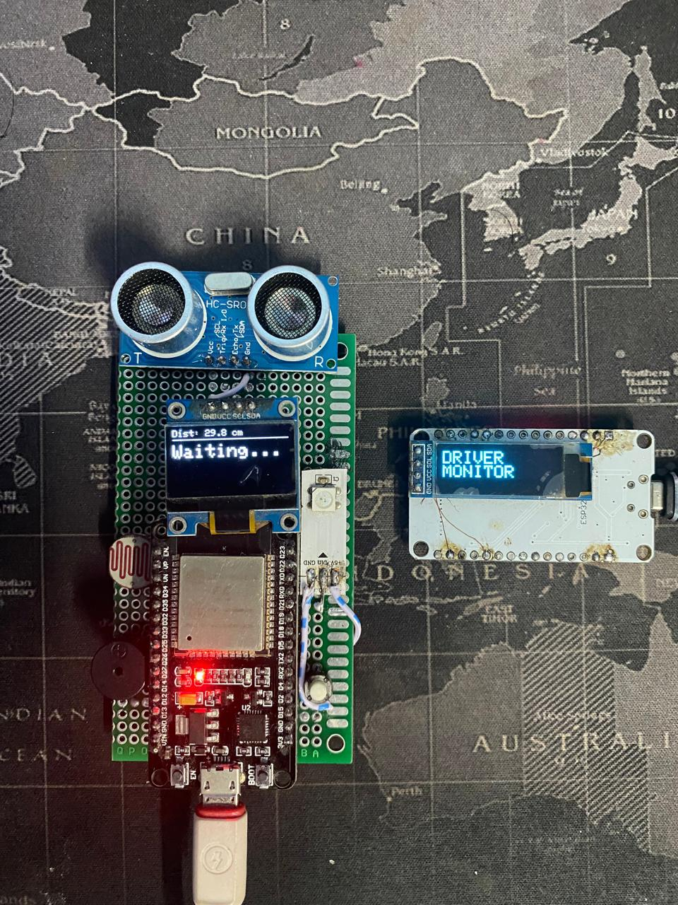
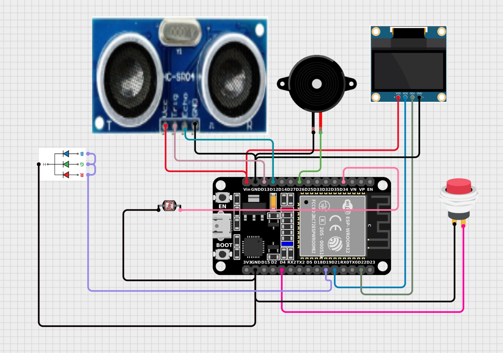
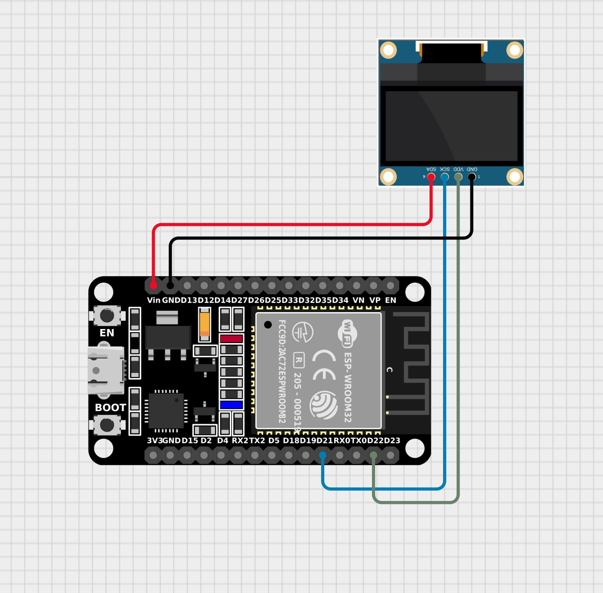
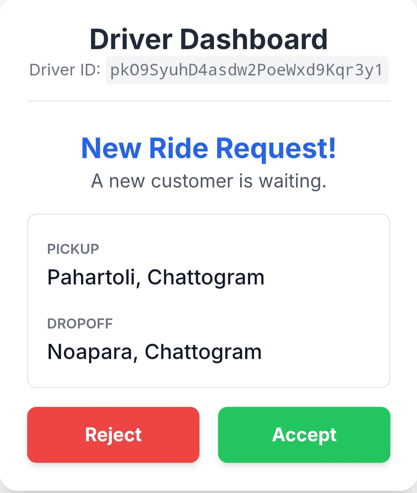

# 🛺 ACCESSIBLE E-RICKSHAW AUTOMATION SYSTEM (AERAS)

---
### **Team Name: IOT_One_Zero**

<p align="center">
  
</p>
---

## **1. Introduction**

The **Accessible E-Rickshaw Automation System (AERAS)** is an assistive IoT-based solution designed for people with disabilities.
It provides an **automated, contactless, and accessible way** to request an e-rickshaw without requiring physical interaction or verbal communication.

AERAS reduces communication barriers by offering:

* Gesture-based user input
* Automatic presence detection
* Contact-free request sending
* Visual LED feedback
* IoT-based real-time driver communication

---

## **2. Problem Statement**

Many differently-abled individuals face difficulties:

* Communicating with drivers
* Signaling vehicles
* Interacting with traditional ride-request systems

**AERAS solves these challenges by introducing:**

* Hands-free activation
* Gesture-based ride requests
* Simple visual feedback (green/red LED)
* IoT communication directly to the driver’s dashboard


---

## **3. System Overview**

### **Block Diagram (Text Version)**

```
 USER SIDE DEVICE
 -----------------------
 | Ultrasonic Sensor  | ---> Detects User Presence
 | Laser Module       | ---> Gesture Beam
 | LDR Sensor         | ---> Reads Gesture
 | Microcontroller    | ---> Processes Input
 | WiFi Module (ESP32)| ---> Sends Request
 | LEDs (Green/Red)   | ---> Visual Feedback
 -----------------------
                |
                |  HTTP Request
                V
 -------------------------
 |  WEB SERVER (Driver)  |
 -------------------------
                |
         Accept / Reject
                |
                V
        Feedback to Device
```


---

## **4. Functional Flow Diagram**

### **A. User-Side Device**

* Detects user presence using an ultrasonic sensor
* Activates if user stays for 3 seconds
* Accepts gesture using laser + LDR
* Sends HTTP request to driver dashboard
* Shows LED feedback based on response

### **B. Driver-Side Web Interface**

* Receives ride request
* Displays **Accept** / **Reject** buttons
* Sends decision back instantly

---

## **Flowchart (Text-Based Version)**

```
      User Approaches Device
                |
                V
     Ultrasonic Sensor Detects
                |
        (Distance < Threshold)
                |
                V
     Start 3-Second Timer
                |
        User Stays? → Yes
                |
                V
          Device Activated
                |
                V
   User Gives Laser Gesture Input
                |
                V
       LDR Detects Gesture
                |
                V
      Request Sent to Server
                |
                V
 Driver Sees Request (Accept/Reject)
                |
       +----------+----------+
       |                     |
       V                     V
   ACCEPT                REJECT
       |                     |
       V                     V
 Green LED ON         Red LED ON
```


---

## **5. Hardware Components**

### **Block Loacation Hardware**

**Ultrasonic Sensor (HC-SR04):**

* VCC → 5V
* GND → GND
* Trig → D13
* Echo → D12

**LDR Sensor:**

* LDR → 34
* 10kΩ resistor → GND

**LED:**

* Addressable LED → D19

**OLED:**

* VCC → 5V
* GND → GND
* SDA → 22
* SCL → 21

**Buzzer:**

* BUZZER → D26

**Button:**

* BUTTON → D4

<p align="center">
  
</p>

### **Rickshaw Side Dashboard**

**OLED:**

* VCC → 5V
* GND → GND
* SDA → 22
* SCL → 21

<p align="center">
  
</p>

---

## **6. Software Components**

### **Driver Web UI**

<p align="center">
  
</p>

---

## **7. Workflow Details**

### **Complete System Architecture (Text Version)**

```
     +--------------------+
     |   User Device      |
     |--------------------|
     | Ultrasonic Sensor  |
     | Laser + LDR Input  |
     | Microcontroller    |
     | WiFi Communication |
     +---------+----------+
               |
               | HTTP JSON Request
               V
     +-------------------------+
     |   Cloud / Local Server  |
     |-------------------------|
     | Request Handling Logic  |
     | Web Dashboard Backend   |
     +-----------+-------------+
                 |
            Web Interface
                 |
     +-------------------------+
     |   Driver’s Smartphone   |
     |-------------------------|
     | Accept / Reject Buttons |
     +-----------+-------------+
                 |
                 | Response
                 V
     +-------------------------+
     | User Device LEDs        |
     | Green / Red Feedback    |
     +-------------------------+
```


---

## **8. Use Case Scenario**

1. A differently-abled person approaches the station.
2. Ultrasonic sensor detects presence.
3. Device activates automatically after 3 seconds.
4. User provides laser gesture.
5. Request goes to driver’s dashboard.
6. Driver accepts.
7. Green LED confirms ride request.


---

## **9. Advantages**

* Fully contactless
* Simple & accessible
* Instant communication
* Low-cost hardware
* Easy for drivers to operate
* Scalable for smart-city transport


---

## **10. Future Improvements**

* Voice command
* Mobile app integration
* GPS nearest-driver mapping
* Digital payment
* Emergency SOS button


---

## **11. Conclusion**

**AERAS** bridges the gap between e-rickshaw drivers and differently-abled individuals, providing a safe and automated ride-request system.
This project shows how IoT can significantly improve accessibility and independence.


---
